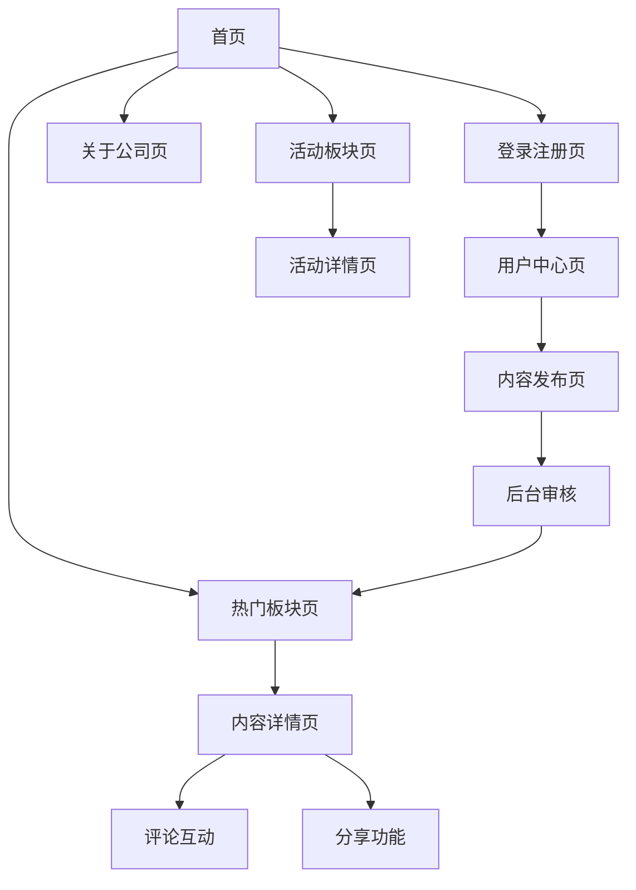

# 多语言社交内容平台产品需求文档

## 1. 产品概述

本项目是一个面向越南市场的多语言社交内容平台，支持用户发布图文视频内容、社交互动、活动展示等功能。平台采用现代化紫色主题设计，支持PC端和移动端自适应访问，默认使用越南语界面。

产品旨在为用户提供一个集内容发布、社交互动、信息获取于一体的综合性平台，通过完善的审核机制确保内容质量，通过多语言支持服务不同地区用户需求。

## 2. 核心功能

### 2.1 用户角色

| 角色    | 注册方式     | 核心权限           |
| ----- | -------- | -------------- |
| 普通用户  | 邮箱/手机号注册 | 发布内容、点赞评论、个人设置 |
| 管理员   | 后台创建账号   | 内容审核、用户管理、系统配置 |
| 超级管理员 | 系统预设     | 全部权限、角色管理、系统维护 |

### 2.2 功能模块

本平台包含以下主要页面：

1. **首页**：导航菜单、热门内容展示、活动推荐、语言切换
2. **热门板块页**：内容列表、筛选排序、标签分类、发布入口
3. **活动板块页**：活动信息展示、活动详情、报名功能
4. **关于公司页**：企业介绍、发展历程、联系方式
5. **用户中心页**：个人信息、发布管理、设置选项
6. **内容详情页**：内容展示、评论互动、分享功能
7. **登录注册页**：用户认证、密码找回、第三方登录
8. **后台管理页**：内容审核、用户管理、数据统计

### 2.3 页面详情

| 页面名称  | 模块名称   | 功能描述                  |
| ----- | ------ | --------------------- |
| 首页    | 导航栏    | 多语言切换、用户登录状态、主要功能入口   |
| 首页    | 热门内容区  | 展示审核通过的热门帖子，支持图文视频预览  |
| 首页    | 活动推荐区  | 展示最新活动信息，点击跳转活动详情     |
| 首页    | 联系合作弹窗 | 点击触发表单弹窗，收集合作意向信息     |
| 热门板块页 | 内容发布   | 支持图文视频上传、标题描述编辑、标签选择  |
| 热门板块页 | 内容列表   | 分页展示、时间排序、热度排序、标签筛选   |
| 热门板块页 | 互动功能   | 点赞计数、评论入口、分享按钮        |
| 活动板块页 | 活动展示   | 活动封面、标题、时间、地点、描述信息    |
| 活动板块页 | 活动管理   | 后台发布活动、编辑活动、状态管理      |
| 关于公司页 | 企业介绍   | 公司简介、发展历程、核心价值观       |
| 关于公司页 | 联系信息   | 地址电话、邮箱、社交媒体链接        |
| 用户中心页 | 个人信息   | 头像昵称、个人简介、隐私设置        |
| 用户中心页 | 内容管理   | 我的发布、草稿箱、审核状态查看       |
| 用户中心页 | 互动记录   | 我的点赞、我的评论、收藏内容        |
| 内容详情页 | 内容展示   | 图文视频播放、作者信息、发布时间      |
| 内容详情页 | 评论系统   | 多级评论、@用户、点赞回复         |
| 内容详情页 | 分享功能   | Facebook、Twitter、复制链接 |
| 登录注册页 | 用户认证   | 邮箱登录、手机登录、密码找回        |
| 登录注册页 | 注册流程   | 信息填写、邮箱验证、协议确认        |
| 后台管理页 | 内容审核   | 待审核列表、审核操作、批量处理       |
| 后台管理页 | 用户管理   | 用户列表、权限设置、封禁管理        |
| 后台管理页 | 数据统计   | 访问量统计、用户增长、内容分析       |

## 3. 核心流程

### 普通用户流程

用户访问首页 → 浏览热门内容 → 注册登录 → 发布内容 → 等待审核 → 内容展示 → 社交互动

### 管理员流程

管理员登录后台 → 查看待审核内容 → 审核通过/拒绝 → 内容状态更新 → 前台展示更新

### 社交互动流程

用户浏览内容 → 点赞/评论 → 回复互动 → 分享传播 → 增加内容热度

## 4. 用户界面设计

### 4.1 设计风格

* **主色调**：紫色系（#6B46C1主色，#9333EA辅助色，#F3F4F6背景色）

* **按钮样式**：圆角设计，渐变效果，悬停动画

* **字体规范**：中文使用思源黑体，英文使用Inter，越南语使用Noto Sans

* **布局风格**：卡片式设计，顶部导航，响应式网格布局

* **图标风格**：线性图标，统一风格，支持多色彩

### 4.2 页面设计概览

| 页面名称   | 模块名称  | UI元素                  |
| ------ | ----- | --------------------- |
| 首页     | 导航栏   | 紫色渐变背景，白色文字，语言切换下拉菜单  |
| 首页     | 热门内容区 | 卡片式布局，图片圆角，阴影效果，悬停放大  |
| 首页     | 活动推荐区 | 横向滚动卡片，紫色标签，时间倒计时显示   |
| 热门板块页  | 发布按钮  | 固定右下角，紫色圆形，加号图标，脉冲动画  |
| 热门板块页  | 内容卡片  | 作者头像，标题截断，标签彩色显示，互动数据 |
| 内容详情页  | 评论区域  | 树形结构，头像圆形，时间灰色，回复缩进   |
| 用户中心页  | 个人信息  | 大头像居中，信息卡片布局，编辑按钮紫色   |
| 联系合作弹窗 | 表单设计  | 居中弹窗，白色背景，紫色边框，表单验证提示 |

### 4.3 响应式设计

* **桌面端优先**：1200px以上完整布局，侧边栏导航

* **平板适配**：768px-1199px响应式网格，折叠侧边栏

* **移动端优化**：768px以下单列布局，底部导航，触摸优化

* **交互优化**：移动端支持滑动操作，长按菜单，手势导航

