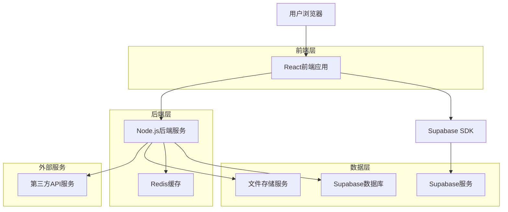
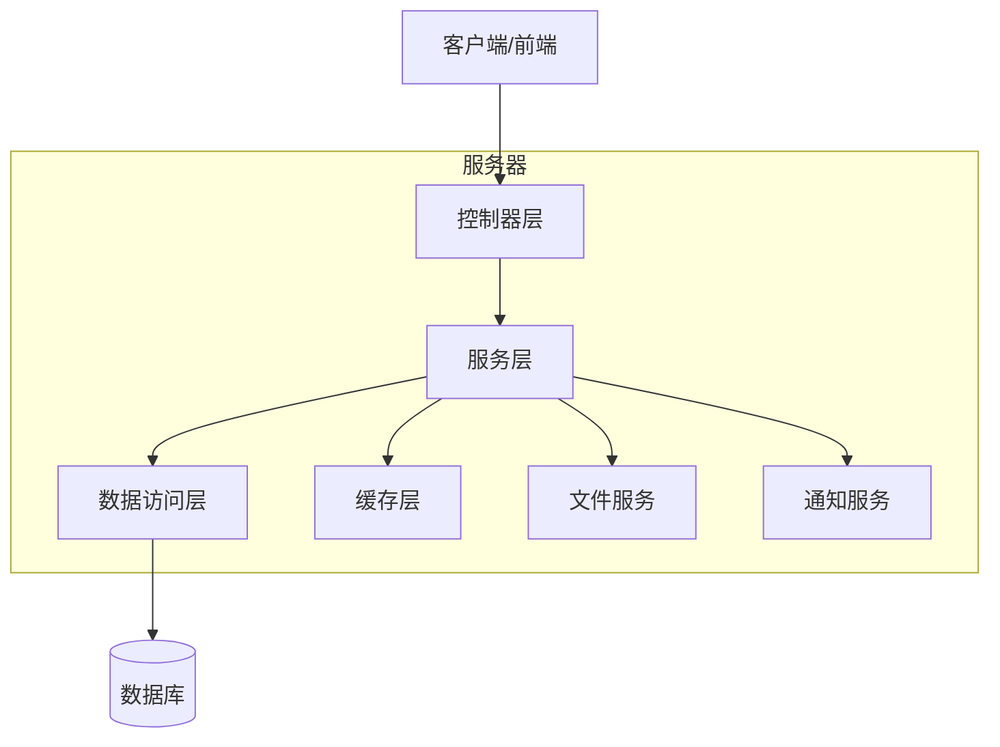
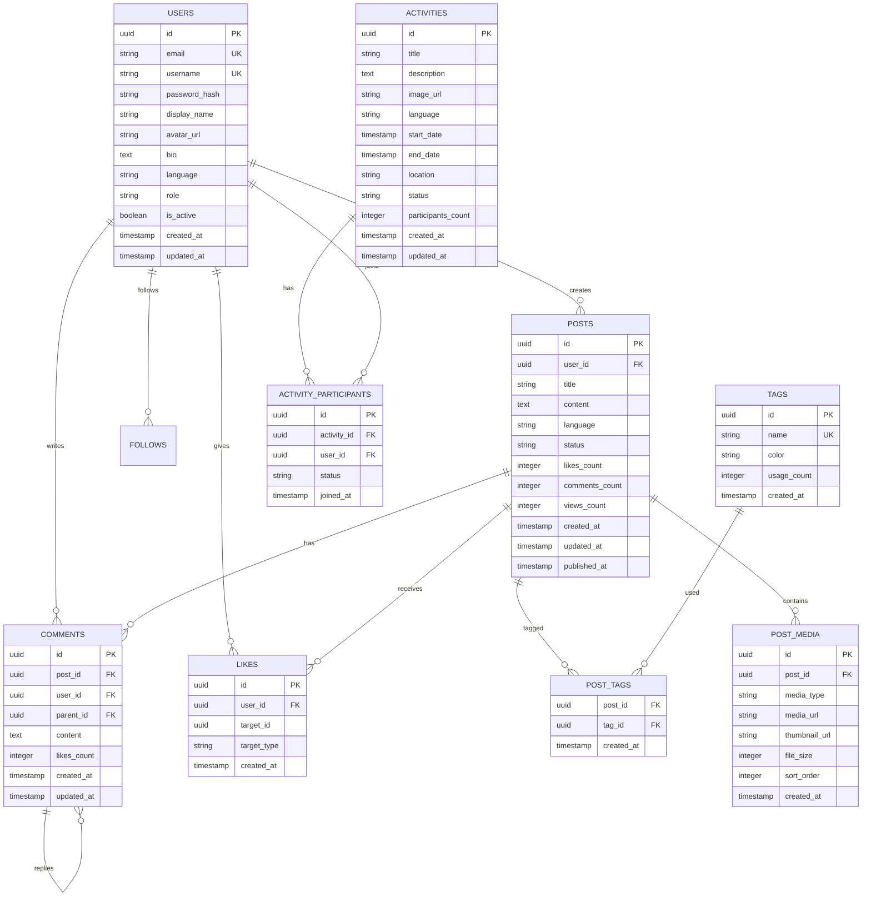

# 多语言社交内容平台技术架构文档

## 1. 架构设计



## 2. 技术描述

* **前端**: React\@18 + TypeScript + Tailwind CSS + Vite + React Router + React Query

* **后端**: Node.js + Express\@4 + TypeScript + JWT认证

* **数据库**: Supabase (PostgreSQL)

* **缓存**: Redis

* **文件存储**: Supabase Storage

* **部署**: Vercel (前端) + Railway (后端)

## 3. 路由定义

| 路由                | 用途              |
| ----------------- | --------------- |
| /                 | 首页，展示热门内容和活动推荐  |
| /hot              | 热门板块页，内容列表和发布功能 |
| /activities       | 活动板块页，活动信息展示    |
| /about            | 关于公司页，企业介绍信息    |
| /post/:id         | 内容详情页，展示具体帖子和评论 |
| /activity/:id     | 活动详情页，展示活动详细信息  |
| /profile          | 个人中心页，用户信息和内容管理 |
| /profile/settings | 个人设置页，账户和隐私设置   |
| /login            | 登录页，用户身份验证      |
| /register         | 注册页，新用户注册       |
| /admin            | 后台管理首页，数据概览     |
| /admin/posts      | 后台内容管理，审核和编辑    |
| /admin/users      | 后台用户管理，权限设置     |
| /admin/activities | 后台活动管理，发布和编辑    |

## 4. API定义

### 4.1 核心API

**用户认证相关**

```
POST /api/auth/register
```

请求参数:

| 参数名      | 参数类型   | 是否必需  | 描述   |
| -------- | ------ | ----- | ---- |
| email    | string | true  | 用户邮箱 |
| password | string | true  | 用户密码 |
| username | string | true  | 用户名  |
| language | string | false | 首选语言 |

响应参数:

| 参数名     | 参数类型    | 描述      |
| ------- | ------- | ------- |
| success | boolean | 注册是否成功  |
| user    | object  | 用户信息    |
| token   | string  | JWT访问令牌 |

示例:

```json
{
  "email": "user@example.com",
  "password": "password123",
  "username": "testuser",
  "language": "vi"
}
```

**内容管理相关**

```
POST /api/posts
```

请求参数:

| 参数名      | 参数类型   | 是否必需  | 描述        |
| -------- | ------ | ----- | --------- |
| title    | string | true  | 帖子标题      |
| content  | string | true  | 帖子内容      |
| media    | array  | false | 媒体文件URL数组 |
| tags     | array  | false | 标签数组      |
| language | string | true  | 内容语言      |

响应参数:

| 参数名     | 参数类型    | 描述     |
| ------- | ------- | ------ |
| success | boolean | 发布是否成功 |
| post    | object  | 帖子信息   |
| status  | string  | 审核状态   |

**社交互动相关**

```
POST /api/posts/:id/like
```

请求参数:

| 参数名    | 参数类型   | 是否必需 | 描述                 |
| ------ | ------ | ---- | ------------------ |
| action | string | true | 操作类型 (like/unlike) |

响应参数:

| 参数名          | 参数类型    | 描述        |
| ------------ | ------- | --------- |
| success      | boolean | 操作是否成功    |
| likes\_count | number  | 当前点赞数     |
| user\_liked  | boolean | 当前用户是否已点赞 |

**评论系统相关**

```
POST /api/posts/:id/comments
```

请求参数:

| 参数名              | 参数类型   | 是否必需  | 描述         |
| ---------------- | ------ | ----- | ---------- |
| content          | string | true  | 评论内容       |
| parent\_id       | number | false | 父评论ID（回复时） |
| mentioned\_users | array  | false | @用户ID数组    |

响应参数:

| 参数名           | 参数类型    | 描述     |
| ------------- | ------- | ------ |
| success       | boolean | 评论是否成功 |
| comment       | object  | 评论信息   |
| notifications | array   | 通知信息   |

## 5. 服务器架构图



## 6. 数据模型

### 6.1 数据模型定义



### 6.2 数据定义语言

**用户表 (users)**

```sql
-- 创建用户表
CREATE TABLE users (
    id UUID PRIMARY KEY DEFAULT gen_random_uuid(),
    email VARCHAR(255) UNIQUE NOT NULL,
    username VARCHAR(50) UNIQUE NOT NULL,
    password_hash VARCHAR(255) NOT NULL,
    display_name VARCHAR(100) NOT NULL,
    avatar_url TEXT,
    bio TEXT,
    language VARCHAR(10) DEFAULT 'vi',
    role VARCHAR(20) DEFAULT 'user' CHECK (role IN ('user', 'admin', 'super_admin')),
    is_active BOOLEAN DEFAULT true,
    created_at TIMESTAMP WITH TIME ZONE DEFAULT NOW(),
    updated_at TIMESTAMP WITH TIME ZONE DEFAULT NOW()
);

-- 创建索引
CREATE INDEX idx_users_email ON users(email);
CREATE INDEX idx_users_username ON users(username);
CREATE INDEX idx_users_language ON users(language);
```

**帖子表 (posts)**

```sql
-- 创建帖子表
CREATE TABLE posts (
    id UUID PRIMARY KEY DEFAULT gen_random_uuid(),
    user_id UUID NOT NULL REFERENCES users(id) ON DELETE CASCADE,
    title VARCHAR(200) NOT NULL,
    content TEXT NOT NULL,
    language VARCHAR(10) NOT NULL DEFAULT 'vi',
    status VARCHAR(20) DEFAULT 'pending' CHECK (status IN ('pending', 'approved', 'rejected', 'draft')),
    likes_count INTEGER DEFAULT 0,
    comments_count INTEGER DEFAULT 0,
    views_count INTEGER DEFAULT 0,
    created_at TIMESTAMP WITH TIME ZONE DEFAULT NOW(),
    updated_at TIMESTAMP WITH TIME ZONE DEFAULT NOW(),
    published_at TIMESTAMP WITH TIME ZONE
);

-- 创建索引
CREATE INDEX idx_posts_user_id ON posts(user_id);
CREATE INDEX idx_posts_status ON posts(status);
CREATE INDEX idx_posts_language ON posts(language);
CREATE INDEX idx_posts_created_at ON posts(created_at DESC);
CREATE INDEX idx_posts_likes_count ON posts(likes_count DESC);
```

**评论表 (comments)**

```sql
-- 创建评论表
CREATE TABLE comments (
    id UUID PRIMARY KEY DEFAULT gen_random_uuid(),
    post_id UUID NOT NULL REFERENCES posts(id) ON DELETE CASCADE,
    user_id UUID NOT NULL REFERENCES users(id) ON DELETE CASCADE,
    parent_id UUID REFERENCES comments(id) ON DELETE CASCADE,
    content TEXT NOT NULL,
    likes_count INTEGER DEFAULT 0,
    created_at TIMESTAMP WITH TIME ZONE DEFAULT NOW(),
    updated_at TIMESTAMP WITH TIME ZONE DEFAULT NOW()
);

-- 创建索引
CREATE INDEX idx_comments_post_id ON comments(post_id);
CREATE INDEX idx_comments_user_id ON comments(user_id);
CREATE INDEX idx_comments_parent_id ON comments(parent_id);
CREATE INDEX idx_comments_created_at ON comments(created_at DESC);
```

**点赞表 (likes)**

```sql
-- 创建点赞表
CREATE TABLE likes (
    id UUID PRIMARY KEY DEFAULT gen_random_uuid(),
    user_id UUID NOT NULL REFERENCES users(id) ON DELETE CASCADE,
    target_id UUID NOT NULL,
    target_type VARCHAR(20) NOT NULL CHECK (target_type IN ('post', 'comment')),
    created_at TIMESTAMP WITH TIME ZONE DEFAULT NOW(),
    UNIQUE(user_id, target_id, target_type)
);

-- 创建索引
CREATE INDEX idx_likes_user_id ON likes(user_id);
CREATE INDEX idx_likes_target ON likes(target_id, target_type);
```

**标签表 (tags)**

```sql
-- 创建标签表
CREATE TABLE tags (
    id UUID PRIMARY KEY DEFAULT gen_random_uuid(),
    name VARCHAR(50) UNIQUE NOT NULL,
    color VARCHAR(7) DEFAULT '#6B46C1',
    usage_count INTEGER DEFAULT 0,
    created_at TIMESTAMP WITH TIME ZONE DEFAULT NOW()
);

-- 创建帖子标签关联表
CREATE TABLE post_tags (
    post_id UUID NOT NULL REFERENCES posts(id) ON DELETE CASCADE,
    tag_id UUID NOT NULL REFERENCES tags(id) ON DELETE CASCADE,
    created_at TIMESTAMP WITH TIME ZONE DEFAULT NOW(),
    PRIMARY KEY (post_id, tag_id)
);
```

**活动表 (activities)**

```sql
-- 创建活动表
CREATE TABLE activities (
    id UUID PRIMARY KEY DEFAULT gen_random_uuid(),
    title VARCHAR(200) NOT NULL,
    description TEXT,
    image_url TEXT,
    language VARCHAR(10) NOT NULL DEFAULT 'vi',
    start_date TIMESTAMP WITH TIME ZONE NOT NULL,
    end_date TIMESTAMP WITH TIME ZONE NOT NULL,
    location VARCHAR(200),
    status VARCHAR(20) DEFAULT 'active' CHECK (status IN ('active', 'inactive', 'completed')),
    participants_count INTEGER DEFAULT 0,
    created_at TIMESTAMP WITH TIME ZONE DEFAULT NOW(),
    updated_at TIMESTAMP WITH TIME ZONE DEFAULT NOW()
);

-- 创建活动参与者表
CREATE TABLE activity_participants (
    id UUID PRIMARY KEY DEFAULT gen_random_uuid(),
    activity_id UUID NOT NULL REFERENCES activities(id) ON DELETE CASCADE,
    user_id UUID NOT NULL REFERENCES users(id) ON DELETE CASCADE,
    status VARCHAR(20) DEFAULT 'joined' CHECK (status IN ('joined', 'cancelled')),
    joined_at TIMESTAMP WITH TIME ZONE DEFAULT NOW(),
    UNIQUE(activity_id, user_id)
);
```

**权限设置**

```sql
-- 为匿名用户授予基本读取权限
GRANT SELECT ON users TO anon;
GRANT SELECT ON posts TO anon;
GRANT SELECT ON comments TO anon;
GRANT SELECT ON tags TO anon;
GRANT SELECT ON activities TO anon;

-- 为认证用户授予完整权限
GRANT ALL PRIVILEGES ON users TO authenticated;
GRANT ALL PRIVILEGES ON posts TO authenticated;
GRANT ALL PRIVILEGES ON comments TO authenticated;
GRANT ALL PRIVILEGES ON likes TO authenticated;
GRANT ALL PRIVILEGES ON tags TO authenticated;
GRANT ALL PRIVILEGES ON post_tags TO authenticated;
GRANT ALL PRIVILEGES ON post_media TO authenticated;
GRANT ALL PRIVILEGES ON activities TO authenticated;
GRANT ALL PRIVILEGES ON activity_participants TO authenticated;
```

**初始化数据**

```sql
-- 插入默认标签
INSERT INTO tags (name, color) VALUES 
('热门', '#FF6B6B'),
('活动', '#4ECDC4'),
('科技', '#45B7D1'),
('生活', '#96CEB4'),
('娱乐', '#FFEAA7'),
('教育', '#DDA0DD'),
('旅游', '#98D8C8');

-- 插入超级管理员用户
INSERT INTO users (email, username, password_hash, display_name, role) VALUES 
('admin@example.com', 'admin', '$2b$10$encrypted_password_hash', '系统管理员', 'super_admin');
```

